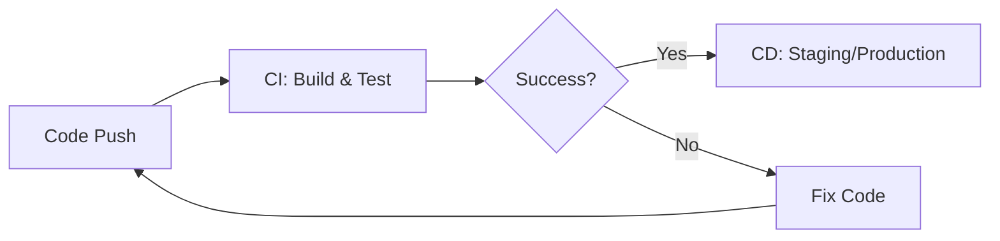

# CI/CD (Continuous Integration / Continuous Deployment)

CI/CD는 애플리케이션 개발 단계부터 배포 때까지의 모든 단계를 자동화하여 사용자에게 더 빠르게 제공하는 방법입니다.

---

## 1. CI (Continuous Integration, 지속적 통합)

개발자들이 작업한 코드를 정기적으로 공용 레포지토리에 통합하고, 이를 자동으로 빌드 및 테스트하는 프로세스입니다.

### 핵심 목표
- **버그 조기 발견**: 자동화된 테스트를 통해 코드 통합 시 발생하는 문제를 즉시 확인합니다.
- **코드 품질 유지**: 모든 변경 사항에 대해 빌드 및 테스트를 수행하여 안정성을 확보합니다.

### 주요 단계
1. **Code**: 개발자가 코드를 수정하고 공유 레포지토리에 Push.
2. **Build**: 새로운 코드를 포함하여 애플리케이션을 빌드.
3. **Test**: 유닛 테스트, 통합 테스트 등을 자동으로 실행.

---

## 2. CD (지속적 서비스 제공 / 지속적 배포)

CI 과정을 거친 코드를 사용자에게 제공하기 위해 운영 환경까지 자동화하여 배포하는 프로세스입니다.

### Continuous Delivery (지속적 서비스 제공)
- 빌드 및 테스트가 완료된 결과물을 운영 환경에 배포할 수 있는 상태로 유지하는 것.
- **최종 배포는 수동**으로 결정하는 경우가 많습니다.

### Continuous Deployment (지속적 배포)
- Continuous Delivery의 확장판으로, 검증된 변경 사항을 **실제 운영 환경에 자동으로 배포**하는 것.
- 고객에게 가장 빠르게 기능을 전달할 수 있는 방식입니다.

---

## 3. CI/CD 파이프라인 워크플로우

---

## 4. 대표적인 CI/CD 도구

| 도구 | 특징 |
| :--- | :--- |
| **Jenkins** | 가장 오래되고 대중적인 오픈소스 도구. 수많은 플러그인을 통한 확장성이 뛰어남. |
| **GitHub Actions** | GitHub 레포지토리와 연동이 매우 쉽고, 별도의 서버 설정이 필요 없음. |
| **GitLab CI** | GitLab 내부에 통합되어 있어 설정이 간편하고 안정적임. |
| **CircleCI** | 클라우드 기반으로 빠른 설정과 실행 속도가 장점. |
| **ArgoCD** | Kubernetes 환경에서 선언적인 배포(GitOps)를 구현할 때 필수적인 도구. |

---

## 5. 도입 효과
- **배포 속도 향상**: 수동 작업이 제거되어 릴리스 주기가 짧아집니다.
- **리스크 감소**: 작은 단위로 자주 배포하므로 문제가 생겨도 원인 파악과 롤백이 쉽습니다.
- **생산성 증가**: 개발자가 인프라나 배포 작업에 신경 쓰지 않고 코드 작성에만 집중할 수 있습니다.
